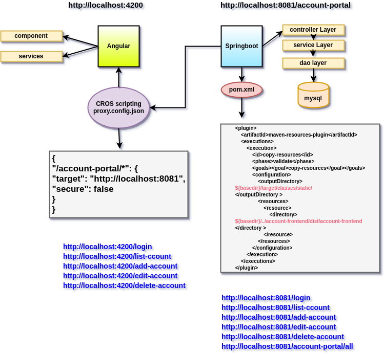
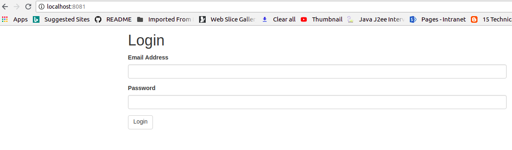
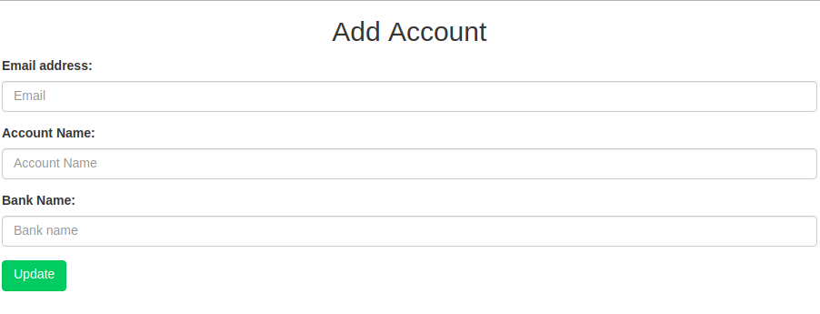
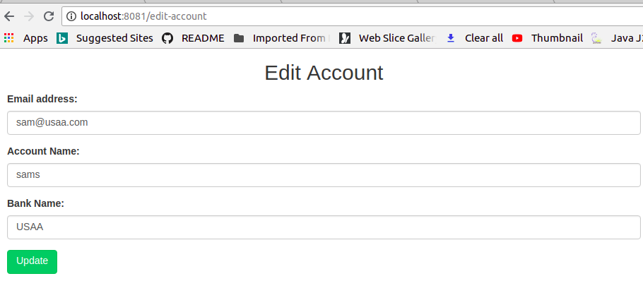

# angular-springboot-integration-demo
This project explains how to integrate springboot and angular by using simple CRUD application

### Output

***Login Screen:***

***View Screen:***

***Add Screen***

***Edit Screen***

***Rest Service***

### Happy Coding 
