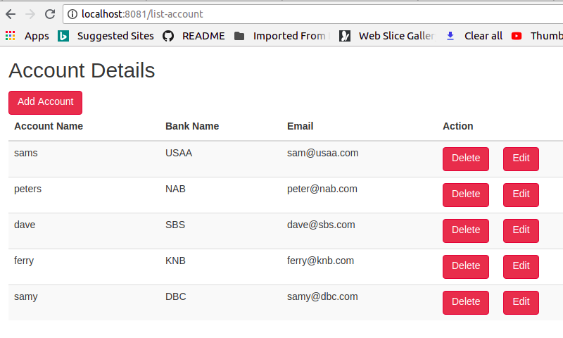

# angular-springboot-integration-demo
This project explains how to integrate springboot and angular by using simple CRUD application

* Technologies used:
  * Springboot
  * Angular6
  * MySql
  * Maven
  
### Key points to remember

Angular
--------

ng g c login -m app.module
ng g c add-account -m app.module
ng g c edit-account -m app.module
ng g c list-account -m app.module
ng g s /service/account
ng g cl /model/account

package.json
------------
"start": "ng serve --proxy-config proxy.config.json"

Build
-----
ng build --prod

Run
---
ng serve


Springboot
----------
pom.xml

```
	   <plugin>
                <artifactId>maven-resources-plugin</artifactId>
                <executions>
                    <execution>
                        <id>copy-resources</id>
                        <phase>validate</phase>
                        <goals><goal>copy-resources</goal></goals>
                        <configuration>
                            <outputDirectory>${basedir}/target/classes/static/</outputDirectory >
                            <resources>
                                <resource>
                                    <directory>${basedir}/../account-frontend/dist/account-frontend</directory >
                                </resource>
                            </resources>
                        </configuration>
                    </execution>
                </executions>
            </plugin>
```

Run
---
mvn clean install

Run the jar file : java -jar <applicationname>.jar

### Overview


### Output

***Login Screen:***


***View Screen:***


***Add Screen***


***Edit Screen***


***Rest Service***


### Happy Coding 
